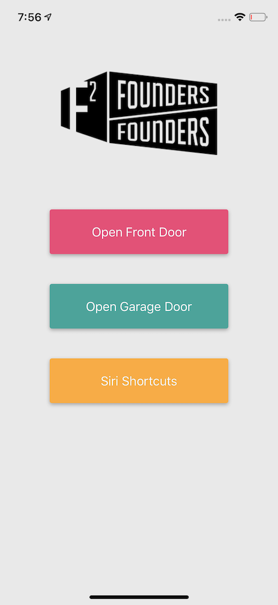
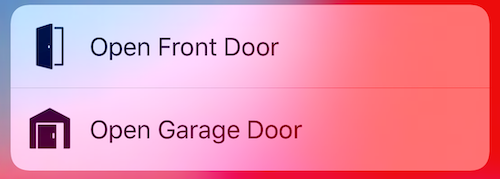
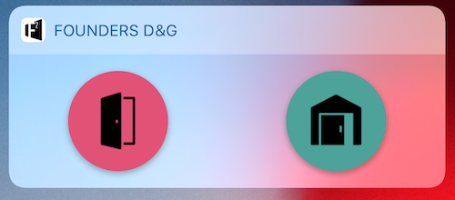

# Founders D&G

### iOS app

iPhone app targeting iOS 12. Tested on iPhone 5S and iPhone X.

> iPhone 5S is the iPhone that supports iOS 12 with the smallest screen. iPhone X has one of the biggest screens.

## Features

### The app itself

The appearance of the app replicates [Founders Founders door services project](http://www.founders-founders.com/doorservices). Here is the main and only screen:

You have 3 buttons:

 1. Open Front Door
 2. Open Garage Door
 3. Siri Shortcuts

The first two should be self-explanatory. They open doors. They only have a different behaviour when the user is not authenticated. In that case, it opens a webview so the user can authenticate on the [Founders Founders workspace on Slack](https://founders2.slack.com).

The third button when touched opens, in the default browser, the [README.md file of Siri Shortcuts](../siri-shortcuts). Long pressing this button will copy the access token.

### Quick Actions

Quick Actions are buttons that are prompted on the home screen when the user presses hard (requires 3D touch) on the icon of the app. Here are the actions presented:

The actions are just a shortcut of pressing the buttons inside the app. So, to follow Apple guidelines, these actions besides opening the doors, also open the app as if you have pressed the buttons.

### Today Widget

If Quick Actions are not quick enough to you (_pun intended!_), then you can rely on the Today Widget. Here is the screen of the widget:

These two buttons should be intuitive enough. They open the front and garage doors. The colour representation is a work in progress. The current idea is to keep the same colour scheme as the buttons inside the app, but one may think that red is to close the door and green is to open. It is not, both open doors.

The only time you may not see these buttons is when you are not authenticated, but it will be displayed a message indicating so.

### Location

The process of opening doors at Founders Founders is made through Slack messages. So, it is easy for one to mistake and open the doors while away. It is now even easier with Today Widget. So, you can prevent yourself from doing any mistake by authorising the app to see your location while it is being used. This way, it will only open the doors once you are close to the building. It is recommended that you have this safety on.

If you prefer to live dangerously, then you can disable this useful feature. You can have other reasons like saving battery and GPS accuracy, but remember that the app only accesses your location while being used (i.e., open).

## Installation

Installing this app is not _that simple_. I do not own a personal developer account. Therefore, I cannot simply place this app on the App Store.

One way to install this app is to open this project on Xcode and deploy to your iPhone. Another way, and you are welcome to do so, is to ask me to install it on your phone. It should take at most 1 minute.

After installing the app, it is normal that if you try to open it you are prompted with a warning. In that case, go to Settings -> General -> Device Management and authorize the app.
